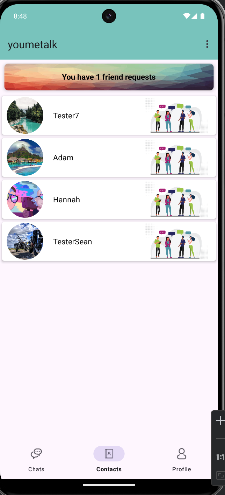

# YoumeTalk
https://github.com/Hannah-Zhang-H/336-as3.git
## Instruction 

YoumeTalk is a chat app for Android devices that allows users to create an account, add friends, start conversations, and manage their contacts. Users can update their profiles, delete message records, and remove friends from their contacts list.

## Features

- **Feature 1**：Users can register an account and create a unique YouMeID, which serves as their identifier on YoumeTalk. This YouMeID is required to be unique and can also be used to add friends directly.
- **Feature 2**：In the homepage,users can access options in the toolbar at the top right of the screen to add a friend, navigate to profile section or sign out.
- **Feature 3**：On the profile page, users can update their profile image, display name, and unique youMeId.
- **Feature 4**：In the contact view, a notification card appears at the top of the page whenever a new friend request is received, allowing users to review and respond easily.
- **Feature 5**：Users can start a chat with any friend directly from their contact list by tap the friend card. Sounds Effects when sending new message.
- **Feature 6**：A new message notification is sent to the system notifications as soon as a message is received. If the user has not accessed the chat yet, the chat card background will be highlighted, and an unread message count will be displayed on the card.
- **Feature 7**：A user can delete one or more message records from their chat without affecting the records on the recipient's end.
- **Feature 8**：A user can also delete a friend from their chat page by tapping the profile image of the friend user wishes to delete.
- **Feature 9**：A user can also reset their password by tapping the link on the Sign-In page.

## Installation Guide

1. **Download the App**：Just download from Stream
2. **Installation**：
   - Step 1：Unzip the source code
   - Step 2：Open in Android Studio
3.1 **Launch the app with Emulator**：Create an Emulator and start (Since Firebase is our database, it may be blocked by university IT systems. To ensure proper functionality, please test the app using your personal network or mobile data.)
3.2 **Launch the app with Mobile Phone**：
    * Connect Your Phone: Use a USB cable to connect your Android device to your computer.
    * Enable Developer Mode: On your Android device, go to Settings > About phone.
Tap Build number seven times to enable Developer options.
    * Enable USB Debugging: In Developer options (usually under Settings > System > Developer options), enable USB debugging.
    * Allow USB Debugging: If prompted, allow USB debugging on your device.
    * Select Device in Android Studio:In Android Studio, go to the Device Manager (at the top toolbar).Select your phone from the connected devices list.
    * Run the App: Press Run (green arrow) in Android Studio to deploy the app to your connected phone.
 

## User Guide

- **Register and Sign in**：Click Sign Up Now and complete the form to register. Enter your email address and password to log in.
- **Main Interface Overview**：
    * Bottom Navigation Bar: Includes three tabs: "Chat," "Contacts," and "Profile." Users can switch between these tabs to access different feature modules.
    * Chat Module: Displays all chat records for the user. Each chat card includes the username, last message content, timestamp, and an indicator for unread messages, highlighted with a count if applicable.
    * Contacts Module: Shows the user’s friend list. If there are new friend requests, a card will appear at the top of the contact list, notifying the user to handle the requests.
    * Profile Module: Allows the user to update personal information such as profile picture, username, and youMeId. The top toolbar provides options to add friends and sign out.
    * Toolbar: Allows the user to navigate to profile Module, Add Friends Module or Sign Out
    * Add Friends Module: Users can search for friends by their youMeId and send a friend request. A user cannot add themselves as a friend or send a request to someone already in their contact list.
    * Friend Requests Module: Displays all current friend requests and allows users to either accept or decline each request.
- **Add a friend**: Navigate to the Add Friend Module via the toolbar to search for a friend’s youMeId. The youMeId must not match the current user's own youMeId or any of the current user's existing friends' youMeIds.
- **Delete a friend**: long-press the friend’s card in the Contact module or tap the friend's profile image in the Chat module.
- **Start a chat**：Tap the friend card in the contact module.
- **Update Profile**：Fill the form out in the Profile Module and tap update button.

## Screenshot

## Update log

### Version 1.0.0

- **First Release**

### Future Development

- **Message Recall**
- **Voice Message Support**
- **Emoji Support**

## Contact

- **Developer 1**：Han Zhang
- **Student ID**：22015651
- **Email**: zhanghannah97@gmail.com

- **Developer 2**：LEI LIU
- **Student ID**：18027070
- **Email**: seanlau1994@gmail.com
